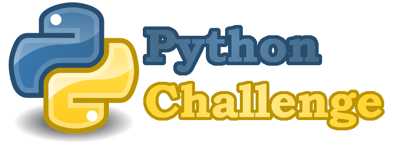

### I was commisioned to use python as a data analytics tool for 4 sets of data:
1. Financial data about a company
2. Voting poll results of a particular town
3. The employee database of a company
4. A paragraph for a learning company

# Changelog:

## **03/19/2021**
- Created the repository
- Updated readme file
- Created the header for readme
- Created /PyBank, /PyPoll, /PyBoss, /PyParagraph
- PyBank
    - created [main.py](PyBank/main.py), /Resources, /analysis
    - copied *.csv files into /Resources
    - created [changelog.md](PyBank/changelog.md)
- PyPoll
    - created "main.py", /Resources, /analysis
    - copied *.csv files into /Resources
    - created "/PyPoll/changelog.md"
- PyBoss
    - created "main.py", /Resources, /analysis
    - copied *.csv files into /Resources
    - created "/PyBoss/changelog.md"
- PyParagraph
    - created "main.py", /Resources, /analysis
    - copied *.txt files into /Resources
    - created "/PyParagraph/changelog.md"

## **03/22/2021**
- analysis done for the finantial data, for details check [changelog.md](PyBank/changelog.md)
- updated readme with links for PyBank
- analysis done for the voting poll data, for details check [changelog.md](/PyPoll/changelog.md)

## **03/23/2021**
- started data reformatting for the employee data
- for details check [changelog.md](PyBoss/changelog.md)

## **03/24/2021**
- finished the PyBoss project
- details in [changelog.md](PyBoss/changelog.md)
- finished paragraph analysis project
- updated [changelog.md](PyParagraph/changelog.md) for paragraph analysis
